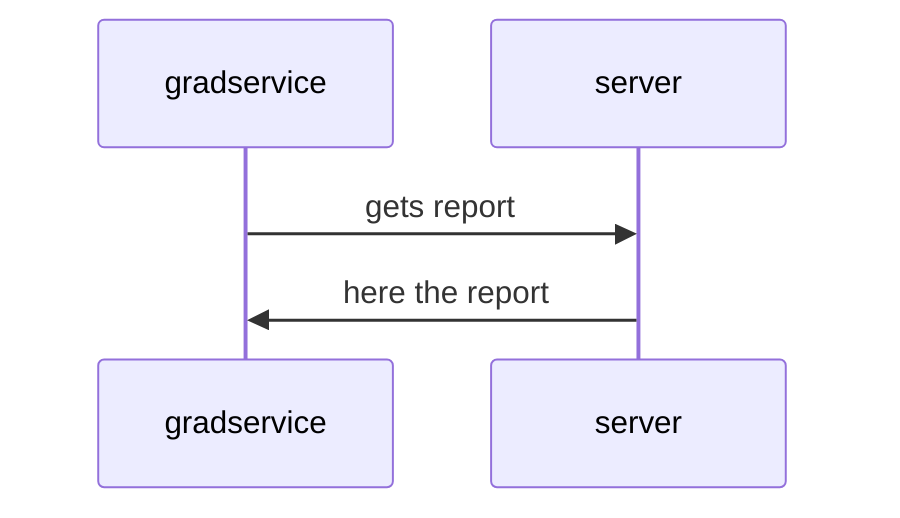
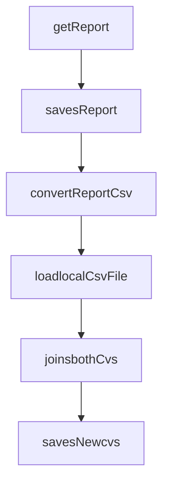

# This is the Zinkworks Graduate Assessment Project
Create an application that will

>Retrieve the json from the https://obs.zinkworks.com/api/v1/Reports
>Convert the data to report.csv
>Join the input.csv with report.csv
>Save as new final.csv file

## UML diagrams

## Flow diagrams

#### The input 
The input.cvs will be given prior to assessment.

#### The working Data 
You will need to retrieve the data from an endpoint above
Data returned from rest call is needed for the assessment
The retrieved json should be converted to csv

#### Output 
You can join the input.csv with the report.csv to create a new final.csv file
*The result.csv file as an **example** of the new file layout****
All files should be submitted as part of your assessment

Zip project and email to
Sharon.keane@zinkworks.com
