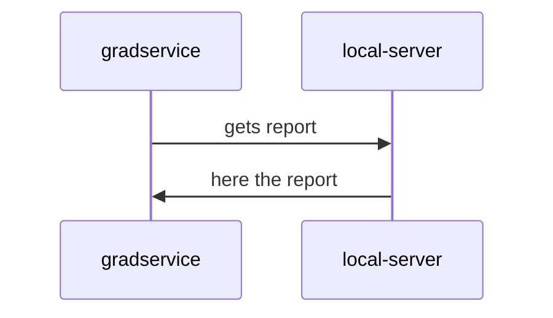
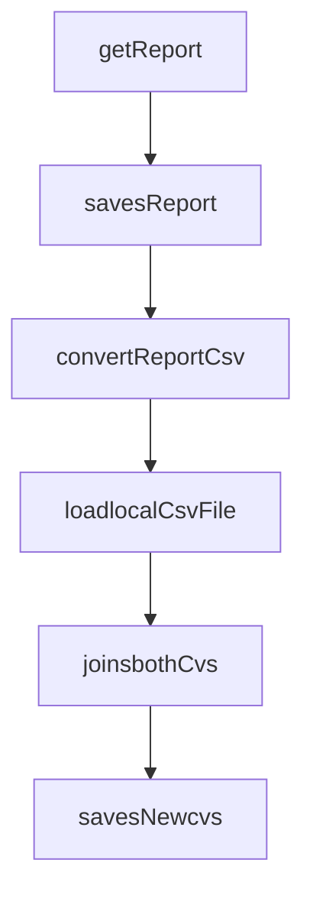

# This is the Zinkworks Graduate Assessment Project

Create workspace folder that contains your full name.

You will need to create an application that calls a GET endpoint  "ipAddress:8080/api/v1/Report"  
This will return list of Data 

You can use Chrome or postman to retrieve the data.
The data retrieved should be appended to the input.csv file given

#### The input 
The input.cvs will be given prior to assessment.

#### The working Data 
You will need to retrieve the data from an endpoint running on the laptop within the room.
You will need to connect to the same internet as the assessors' laptop
Data returned from rest call is needed for the assessment and should be appended to the data from the input csv
This should create a new output csv
NOTE: Endpoint ip will be provided prior to assessment

#### Output 
Your code and an output csv should be left open on your laptop at the end of the assessment.
Your output csv should be similar to the example file result.csv

*The result.csv file as an **example** of the new file layout 

## UML diagrams

## Flow diagrams
